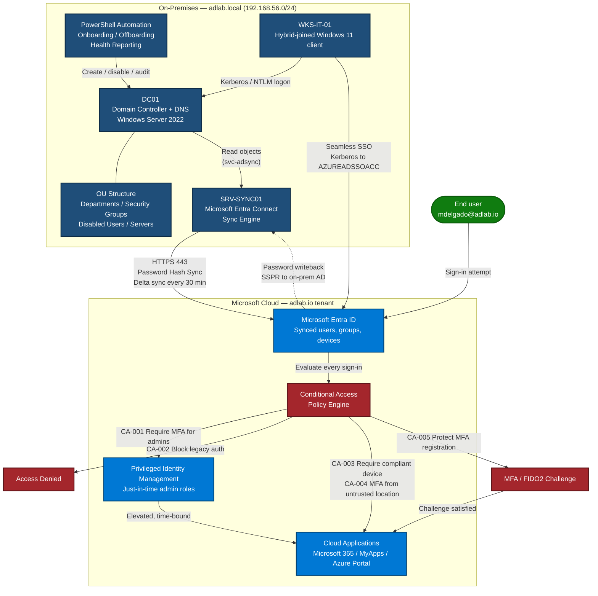

# Hybrid Cloud AD Lab

**On-premises Windows Server Active Directory integrated with Microsoft Entra ID via Microsoft Entra Connect — a documented home-lab build covering identity lifecycle automation, least-privilege RBAC, Conditional Access and enterprise troubleshooting.**

---

## Overview

This repository documents a personal home lab in which I deployed a Windows Server 2022 Active Directory domain (`adlab.local`) and integrated it with a Microsoft Entra ID tenant (`adlab.io`) using Microsoft Entra Connect with Password Hash Synchronisation, Seamless SSO and password writeback. On top of that hybrid foundation I built the things a real identity environment actually needs: a departmental OU structure that GPO and delegation can target, PowerShell automation for the full joiner/mover/leaver lifecycle, a daily identity-hygiene audit, a least-privilege delegation model that keeps humans out of Domain Admins, and a Conditional Access catalogue that blocks legacy authentication and enforces phishing-resistant MFA for administrators. Every script, policy and runbook here was written and tested against the lab, and every troubleshooting scenario is a failure I actually reproduced and fixed — including the ones I caused myself.

---

## What this lab demonstrates

- **Hybrid identity synchronisation** — a single on-premises identity projected into Microsoft Entra ID with Entra Connect: Password Hash Sync, Seamless SSO, password writeback, OU-scoped sync filtering, and the `ms-DS-ConsistencyGuid` source anchor. Includes the routable-UPN-suffix problem that a `.local` domain forces you to solve *before* the first sync.
- **Automated onboarding and offboarding** — CSV-driven user provisioning (deterministic username generation, collision handling, correct OU placement, department group membership, forced password change) and a "disable, don't delete" leaver process that strips groups, relocates the object, sets account expiration and produces an audit-ready confirmation report.
- **RBAC and least privilege** — four delegated roles (Helpdesk Operators, User Account Admins, Server Admins L1, Read-Only Auditors) with OU-scoped ACLs, documented permissions, and an explicit list of what each role is *denied* and why. Nobody performs daily work as Domain Admin.
- **MFA and Conditional Access** — five documented policies covering admin MFA with phishing-resistant authentication strength, blocking legacy authentication, compliant-device requirements for sensitive apps, step-up MFA from untrusted locations, and protection of the security-info registration flow itself. Includes break-glass account design and a rollout order that does not lock out the tenant.
- **Enterprise troubleshooting** — five Symptom → Diagnosis → Resolution runbooks with the actual diagnostic commands: account lockout loops traced through Event ID 4740/4771, Kerberos `KRB_AP_ERR_MODIFIED` from duplicate SPNs, GPO filtering failures (including the MS16-072 trap), synced users who cannot sign into cloud apps, and MFA lockout recovery with Temporary Access Pass.
- **Read-only auditing** — a health report covering locked-out accounts, disabled accounts, passwords expiring within a window, accounts with `PASSWD_NOTREQD` set, and stale computer objects, with console tables and CSV export suitable for a scheduled task.

---

## Architecture



**Identity flow in one sentence:** a user is created on-premises by automation, lands in a departmental OU, syncs to Microsoft Entra ID within 30 minutes carrying a doubly-hashed password credential, and every subsequent cloud sign-in is evaluated by Conditional Access before an application is ever reached.

---

## Tech stack

| Layer | Technology |
|---|---|
| Directory services | Windows Server 2022 — AD DS, DNS, forest/domain functional level 2016 |
| Hybrid sync | Microsoft Entra Connect (Password Hash Sync, Seamless SSO, password writeback) |
| Cloud identity | Microsoft Entra ID — Conditional Access, Identity Protection, PIM |
| Automation | PowerShell 5.1 — `ActiveDirectory`, `GroupPolicy`, `ADSync`, `Microsoft.Graph` |
| Policy | Group Policy Objects, OU-scoped delegation (ACLs), Restricted Groups |
| Client | Windows 11 Enterprise, Microsoft Entra hybrid joined |
| Virtualisation | Hyper-V (three VMs on an internal 192.168.56.0/24 network) |
| Docs | Markdown, Mermaid diagrams |

---

## Repository structure

```
hybrid-cloud-ad-lab/
├── README.md
├── powershell/
│   ├── Set-OUStructure.ps1              # Departmental OU hierarchy (idempotent, -WhatIf)
│   ├── New-EmployeeOnboarding.ps1       # CSV-driven user provisioning + summary report
│   ├── Remove-EmployeeOffboarding.ps1   # Disable / de-group / relocate / expire + report
│   └── Get-ADHealthReport.ps1           # Read-only identity hygiene audit + CSV export
├── policies/
│   ├── rbac-role-definitions.md         # Least-privilege delegation model
│   └── conditional-access-examples.md   # 5 documented CA policies + interaction matrix
├── docs/
│   ├── lab-setup-guide.md               # Bare VM → synced user signing into a cloud app
│   ├── troubleshooting-scenarios.md     # 5 Symptom → Diagnosis → Resolution runbooks
│   └── suggested-commit-plan.md         # How this repo's history was built, commit by commit
└── sample-data/
    └── employees.csv                    # 5 fictional employees for the onboarding script
```

---

## Prerequisites

**Infrastructure**

- A hypervisor (Hyper-V, VMware Workstation, VirtualBox or Proxmox) with ~16 GB RAM available
- Three VMs: Domain Controller (2 vCPU / 4 GB), Entra Connect server (2 vCPU / 8 GB), Windows 11 client (2 vCPU / 4 GB)
- An internal virtual network with internet access via NAT
- Windows Server 2022 evaluation ISO and a Windows 11 Enterprise evaluation ISO

**Cloud**

- A Microsoft Entra ID tenant (a free tenant works; Entra ID P1/P2 trial needed for Conditional Access and PIM)
- A public DNS domain you control, to verify as a custom domain and use as a routable UPN suffix
- A Global Administrator account for the initial Entra Connect setup

**Local tooling**

- PowerShell 5.1 or later
- RSAT: Active Directory module (`Install-WindowsFeature RSAT-AD-PowerShell`)
- `Microsoft.Graph` PowerShell SDK (`Install-Module Microsoft.Graph -Scope CurrentUser`)
- Administrative rights in the lab domain

**Knowledge**

- Comfortable with basic AD concepts (OUs, groups, GPOs) and reading PowerShell

---

## Quick start

```powershell
# 1. Clone the repository onto the domain controller (or a management workstation with RSAT).
git clone https://github.com/Clxnsy/hybrid-cloud-ad-lab.git
cd hybrid-cloud-ad-lab\powershell

# 2. Build the OU hierarchy. ALWAYS dry-run first - every script supports -WhatIf.
.\Set-OUStructure.ps1 -WhatIf -Verbose
.\Set-OUStructure.ps1 -Verbose

# 3. Provision the sample employees from CSV.
.\New-EmployeeOnboarding.ps1 -CsvPath ..\sample-data\employees.csv -WhatIf -Verbose
.\New-EmployeeOnboarding.ps1 -CsvPath ..\sample-data\employees.csv -Verbose

# 4. Audit the directory (read-only - safe to run anywhere, anytime).
.\Get-ADHealthReport.ps1 -Verbose

# 5. Test the leaver process against one of the sample users.
.\Remove-EmployeeOffboarding.ps1 -Identity tnyberg -Reason 'Lab test' -WhatIf -Verbose
```

Then follow **[docs/lab-setup-guide.md](docs/lab-setup-guide.md)** for the full build: DC promotion, the routable UPN suffix, Entra Connect installation, sync verification, and testing a synced user signing into a cloud application.

**Suggested reading order**

1. [docs/lab-setup-guide.md](docs/lab-setup-guide.md) — build it
2. [policies/rbac-role-definitions.md](policies/rbac-role-definitions.md) — secure the on-prem side
3. [policies/conditional-access-examples.md](policies/conditional-access-examples.md) — secure the cloud side
4. [docs/troubleshooting-scenarios.md](docs/troubleshooting-scenarios.md) — fix it when it breaks

---

## Safety notes

- **Every state-changing script supports `-WhatIf`.** Nothing in this repository deletes a user account. The offboarding script disables and relocates; `Get-ADHealthReport.ps1` is strictly read-only.
- **The offboarding script uses `ConfirmImpact = 'High'`**, so it prompts before acting unless you explicitly pass `-Confirm:$false`, and it refuses to silently offboard an account holding privileged group membership.
- **Onboarding reports contain temporary passwords.** They are written to `./reports/`, which is git-ignored. Hand them over through an approved channel and delete the file.
- **Run these against a lab first.** They are written to production standards, but you are responsible for testing in your own environment before pointing them at anything that matters.

---

## Lessons learned

**The `.local` domain name cost me an entire evening — and taught me the most.** I promoted the domain as `adlab.local` without thinking about what happens downstream. Microsoft Entra ID cannot verify a non-routable suffix, so my first sync silently rewrote every UPN to `@adlabio.onmicrosoft.com`. Users existed in the cloud but with a different sign-in name than they had on-premises, which broke SSO in a way that looked like a sync fault rather than a naming fault. Adding a routable UPN suffix *before* installing Entra Connect takes about ninety seconds. Fixing it afterwards means a bulk UPN change and re-authenticating everyone. I now treat "is the UPN routable and is the domain verified?" as the first question in any hybrid design conversation.

**"The account is synced" and "the user can sign in" are completely different claims.** I lost a good hour on a user who was visibly present in the Entra portal but could not authenticate. The cause was my own onboarding script doing exactly what I told it to: forcing a password change at next logon. When `pwdLastSet = 0` there is no current password for Password Hash Sync to hash, so the cloud object existed with no usable credential — surfacing as a generic "your password is incorrect". That taught me to stop trusting object presence as proof of anything and to read the sign-in log's error code instead of the UI's error message. `AADSTS50126` and `AADSTS53003` mean completely different things and point at completely different teams.

**Writing `-WhatIf` support into every script changed how I work.** I added `SupportsShouldProcess` initially because it is what good PowerShell looks like. Then it caught a real mistake: a dry run of the offboarding script against what I thought was a test account showed it was about to strip membership from a group I needed. In a lab that is an inconvenience; against production it is an incident. The discipline of "dry run, read the output, then run for real" is now automatic, and I no longer trust any script — including my own — that cannot tell me what it is about to do.

**Least privilege is a design decision, not a cleanup task.** My first instinct when building the helpdesk role was to grant broad rights over the Departments OU and trim later. Trimming later never happens; there is always something more urgent. Writing `rbac-role-definitions.md` *before* touching the delegation wizard forced me to articulate why the helpdesk should not be able to modify group membership — because group membership *is* authorisation, and a Tier 1 technician who can add users to groups can add themselves to any group. Documenting the denials turned out to be more valuable than documenting the grants.

**Conditional Access order matters more than Conditional Access content.** I enabled a compliant-device requirement before hybrid join had finished rolling out and locked myself out of my own tenant on the test client. Break-glass accounts saved me, which is precisely why they exist — but the real lesson was procedural: report-only mode for at least a week, one policy at a time, and never enable a policy whose prerequisite (device enrolment, MFA registration) is not already complete for the target population. I also learned that a policy protecting MFA is worthless if the *registration* flow for MFA is unprotected — an attacker with a stolen password will simply enrol their own authenticator. CA-005 exists because of that realisation.

**Troubleshooting is pattern recognition, and patterns only come from repetition.** The first time I hit `KRB_AP_ERR_MODIFIED` I spent two hours reading Kerberos internals. The second time I ran `setspn -X`, found the duplicate in thirty seconds, and moved on. "Works by IP, fails by hostname" now instantly means Kerberos rather than networking. Building the runbooks in `troubleshooting-scenarios.md` while the problem was fresh — including the commands that *did not* help — is the single highest-value thing in this repository, and it is the part I reach for most often.

**Documentation written for a future stranger is documentation written for future me.** I built this repo assuming someone else would read it, which forced me to explain *why* each step exists rather than just listing steps. Two months later I came back to rebuild the lab after a host failure and followed my own setup guide end to end without touching a search engine. That is the actual return on writing things down properly.

---

## Roadmap

- [ ] Group Policy baseline export (CIS-aligned starter GPOs) with import scripting
- [ ] LAPS / Windows LAPS deployment for local administrator password rotation
- [ ] Pester tests for the PowerShell modules
- [ ] Entra ID Protection risk-based policy walkthrough
- [ ] Terraform/Bicep for the Azure-side resources
- [ ] Attack simulation: Kerberoasting detection and response in the lab

---

## Disclaimer

**This is a sanitized personal home lab, not a production environment.**

Every domain (`adlab.local`, `adlab.io`), tenant name, hostname, IP address, user account, group name, ticket number and error scenario in this repository is **fictional** and was created for learning and demonstration purposes. No real tenant identifiers, object GUIDs, subscription IDs, employee data, credentials or production configuration appear anywhere in this repository or its history.

The scripts and policies here reflect practices I consider sound, but they are provided as **study material and portfolio work**. Review, test and adapt anything you take from here in your own lab before it goes near a system that matters. Any resemblance to a real organisation's configuration is coincidental.

---

## License

MIT — see [LICENSE](LICENSE).
